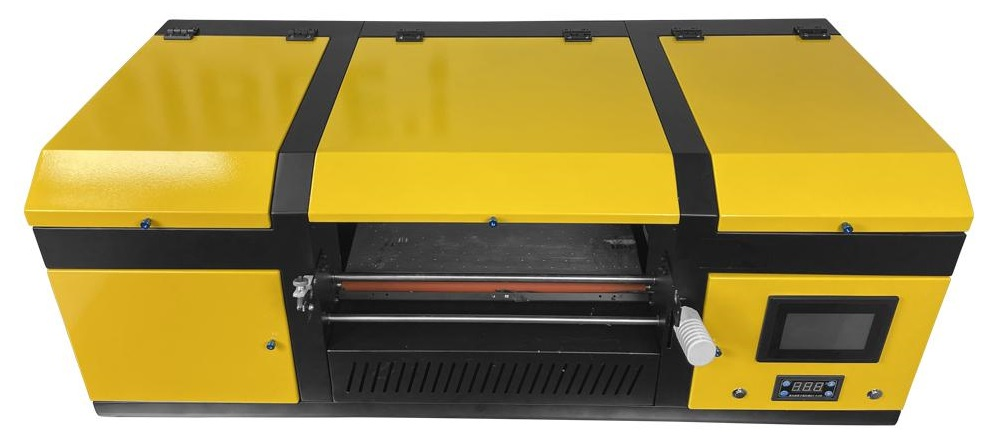
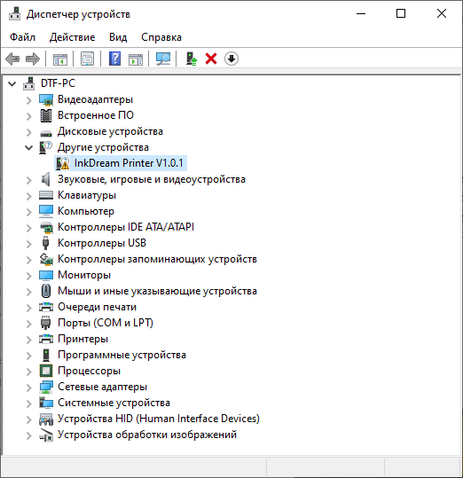
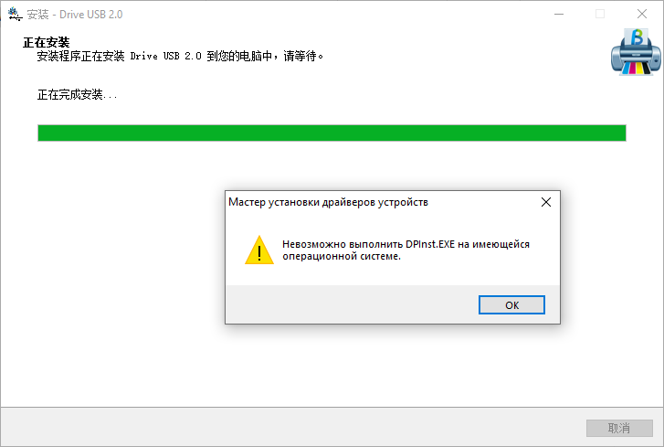

# <a href="https://www.color-sun.com/sdp/337300/4/pd-1485445/21107584-2969419/A3_Size_2_In_1_With_Laminator_Direct_To_Ab_Film_UV.html">COLORSUN UV DTF</a>

<b>Статус оборудования:</b> проблема с установкой драйвера (Невозможно запустить DPinst.exe на вашей операционной системе)

В диспетчере устройств принтер отображается как: <b>InkDream Printer V1.0.1</b>

## Ключи

## Решения:
- <s>Установка драйвера с всеми возможными совместимостями от имени администратора</s>
- Включение поддержки x32 приложений
- <s>Установка чистой win 10 Pro 22H2 x64</s>
- <s>Установка чистой win 10 Pro 15XX x64 (2015 года, когда Microsoft убрали DPinst из ОС)</s>
- Установка win 7 x32
- Установка win 7 x64

## Письмо в поддержку
<a href="https://u.wechat.com/MLusoXAwFwLZH03HaIT8UBg">WeChat</a> 
<a href="info@color-sun.com">info@color-sun.com</a> 
<a href="">WhatsApp:+86 18607557659</a> 

Проблема: не устанавливается драйвер
<a href="driver/W_Device 2.0.exe">W_Device 2.0.exe</a>

